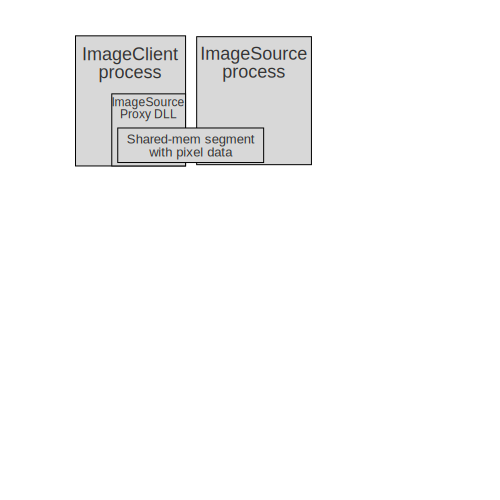

Sample code for custom COM marshaling with shared memory. This pattern can be used for **zero-copy exchange of large buffers between processes**. The implementation is _transparent_, meaning that clients doesn't notice that the COM `SAFEARRAY` buffers reside in shared memory.

### Overview
<!-- Use https://boxy-svg.com/ to edit the SVG -->

| Project          | Description |
|------------------|-------------|
| `ImageSource`    | COM _server_ EXE that exposes image-data. |
|`ImageSourceProxy`| COM _proxy_ DLL that is automatically loaded into the client process to facilitate custom marshaling. |
| `ImageClientCpp` | Sample C++ command-line project for accessing image-data through shared memory. |
| `ImageClientCs`  | Sample C# command-line project for accessing image-data through shared memory. |
| `UnitTests`      | Unit-test project. |

### Getting started
#### Instuctions
* Start Visual Studio with admin privileges.
* Open `SharedMemMarshal.sln` solution.
* Build all projects.
* Start `ImageClientCpp` or `ImageClientCs` project.
* Observe that the client project is able to access image-data exposed by the `ImageSource` process without any copying.

#### Cleanup
Run `UNREGISTER_ALL.bat` with admin privileges to clean up all registry entries.

### DCOM garbage collector note
Associated StackOverflow question: [How to leverage DCOM garbage collector with custom marshaling? (IMarshal)](https://stackoverflow.com/questions/69010789/how-to-leverage-dcom-garbage-collector-with-custom-marshaling-imarshal) (answered)

The DCOM garbage collector usually cleans up leaking stub references after client processes terminate. This automatic garbage collection is unfortunately not available for classes implementing IMarshal. This limitation can be worked around by introducing an extra COM object for maintaining references from the client-side proxy back to the server. This is implemented using a tiny `RefOwner` class that is marshalled using `CoMarshalInterface`/`CoUnmarshalInterface` from the server to the proxy.

### Links
* [IMarhal](https://learn.microsoft.com/en-us/windows/win32/api/objidl/nn-objidl-imarshal) interface
* Inside COM+: [Will That Be Custom or Standard Marshaling?](https://thrysoee.dk/InsideCOM+/ch14c.htm) - uses event objects to synchronize destruction from proxy to server.
* .Net [unmanaged memory leak when c# get data from COM component](https://github.com/dotnet/runtime/issues/121291) issue (resolved).
